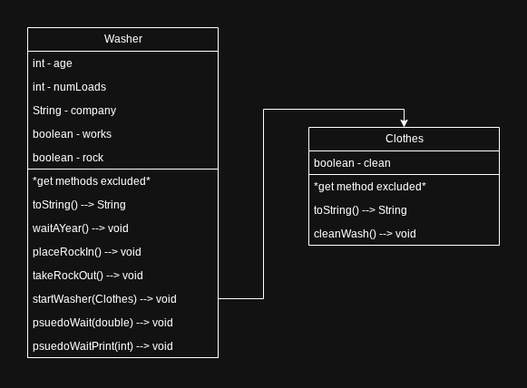

# Abstraction Washer
## Description
Program that demonstrates ==abstraction== by representing a washing machine with variables and methods
## Features
- Washer and clothes object implementation
- Complete rock placement functionality
## How the code works
Uses classes to allow construction of washer and clothes objects. Class diagram shown below.

## How to code runs
1. Download and extract zip
2. Open App.java and run

The main method is pretty trivial, and only shows off some of the features. Look at the javaDoc comments for the method explanation.
